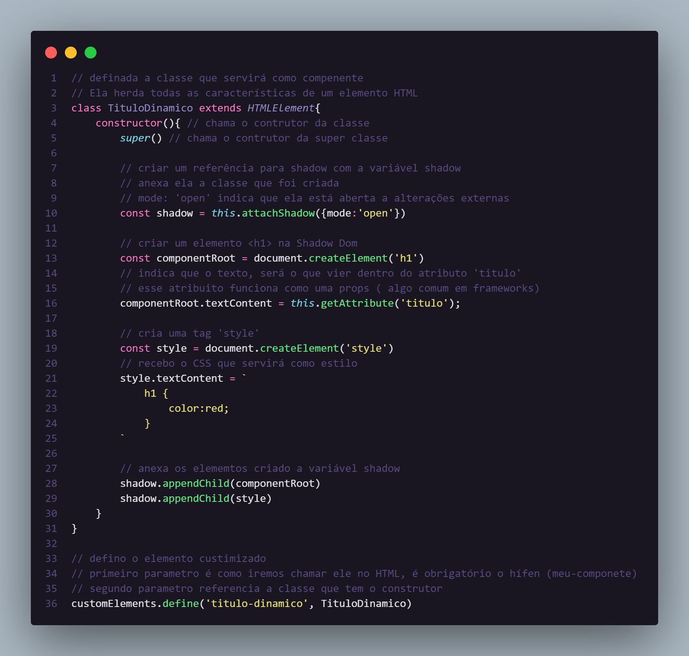
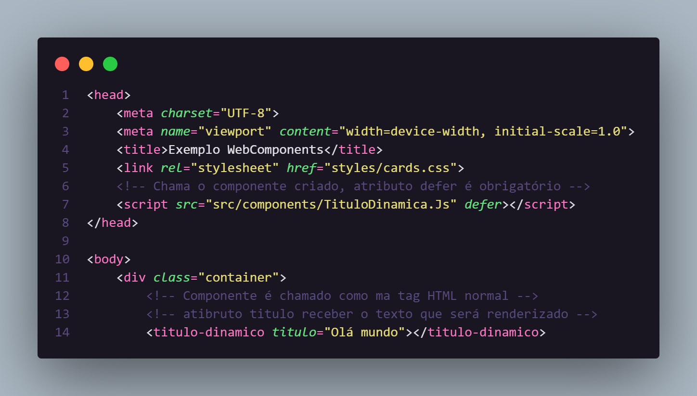
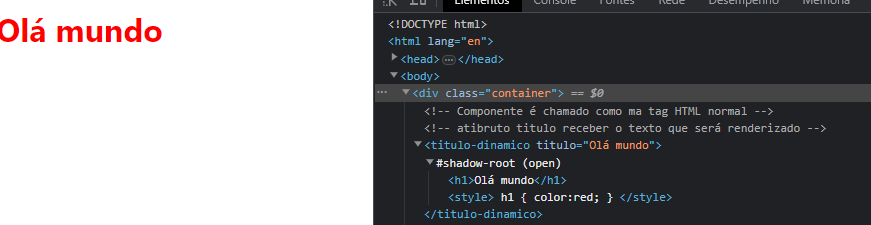

# Trabalhando com Web Components no Front end

#  🌐 Webcomponents

Componentes nada mais são que são tags HTML encapsuladas, gerando vantagens na aplicação como:

- Reaproveitamento do código;
- Lógica, dinâmica e comportamento;
- CSS próprio.

##  ✅ Reaproveitando o código:

Pelo fato dos componentes serem agrupamentos de tags HTML, essas tags ao serem encapsuladas podem ser utilizadas em diferentes partes do nosso código, diminuindo a verbosidade e facilitando a manutenção

## ✅ Lógica, dinâmica e comportamento:

Outra vantagem dos componentes é a possibilidade de deixarmos nosso componente inteligente, inserindo validações e condições, fazendo que o componentes se comporte de maneiras diferentes.

## ✅ CSS próprio:

Outro ponto que pode ser considerado, é o fato os componente poderem possuir um estilo próprio, sem afetar os demais elemento da página, já que o CSS estará sendo aplicado apenas dentro do contexto do compenente.

Apesar de componentes serem um assunto corriqueiro, quando se falo em frameworks, também podemos criar nosso próprios componentes de maneira manual, para isso devemos utilizar de uma técnica para manipulação do Shadowdom.

## 🌉 Shadow Dom:

Nos permite criar elementos HTML customizados ( customElements ), em formato de componentes.

Em conceito, a ShadowDom viveria as sombras da DOM real. Ele existes apenas para o nosso componente, e todos as alterações e estilos existem apenas no escopo local, não vazando para os demais elemento.

## Anatomia de um CustomElement:

### 🏗️ Construção:

### 🧩 Usando no HTML:

### ✅ Resultado no navegador:

## 🫡 Certicado

