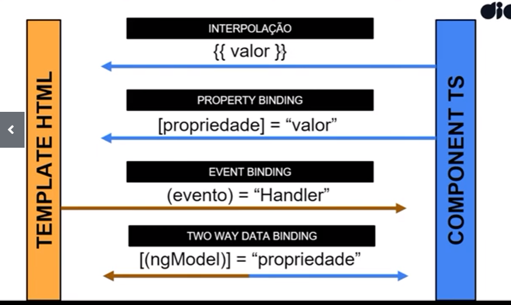
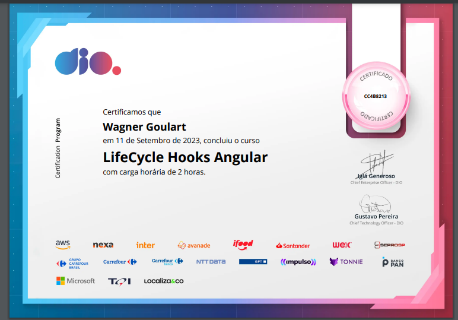

# Binding Sintax 

A troca de informações entres os componentes no Angular é feita através do Data Bindig.

Podem ser de 3 tipos:

- Da View para lógica - ( Event Binding )
- Da lógica para View  - {{ string interpolation }} e [property biding]
- Entre lógica e view  = [(Two way Data Binding)]

## Da View para Lógica:

O Event Biding, é o responsável por capturar os eventos que ocorrem na View - como o clique em um botão. Esse evento será responsável por disparar alguma funcionalidade que está atribuída a esse evento.

O evento é chamado detro de paranteses ( ) e recebe como valor a método ou lógica que queremos aplicar quando esse evento é disparado.

```jsx
// (click) devido o envento que será escutado
// "onSave()" chama um função definida quando o clique é excutado.
<button type="button" (click)="onSave()">Save</button>
```

---

## Da Lógica para view:

Aqui as informações que queremos são processados dentro dos arquivos .TS onde é programado a lógica e essas informações são enviados para a View:

### String Interpolation {{ }}:

Utilizando a interpolações de string, é possível deixar os valores do HTML dinâmico esse valores são processados nos componentes e enviados para o HTML.

A interpolação é feita chamando o atributo do componente dentro do HTML, esse atributo deve ser chamado entre {{ }} 2 pares de chaves

```jsx
export class App {
  name = 'Angular'; // atributo dentro do componente
}

<h1>Hello from {{ name }}!</h1> // atributo sendo chamado no HTML.
```

### Property Binding:

Funciona de forma semelhante ao string interpolation, mas o binding é aplicado ao atributo HTML.

Indicamos ao Angular que iremos realizar uma property Binding colocando o atributo HTML entre colchetes [ ];

```jsx
export class App {
  image : string = 'http://placekitten.com/200/300' // imagem dentro do componnente,
}

 // property binding dentro do atributo souce,
											// indica o caminho onde está a imagem
```

---

### Entre lógica e view:

O famoso Two-way data binding do Angular, permite atualizar o componente e o template HTML simultaneamente, especialmente útil para se trabalharmos com formulários.

Ele é chamado com a sintax [( ngModel )]:

```jsx
<h1>Two Way Data binding</h1>
    <form>
// [(ngModel)] irá mapeas a propriedade name,
// Sempre que sofre uma alteração será atualizada

      <input [(ngModel)]="name" name="name" />
    </form>
// Conforme a propriedade name é atualizado dentro do input
// Seu valor tabmém será atualizar e exibido dentro do <p>
    <p>{{name}}</p>
    
  `,
})
export class App {
  name = ''; // aqui definimos a propriedade name como uma string vazia
}
```

---

### Em resumo:

- {{  propriedade }} → interpolation;
- [ atributo ] → property binding
- [ ( ngModel ) ] → Two-way data binding
- 



---

## LifeCycle:

Assim como os demais frameworks e bibliotecas existentes no mercado hoje em dia, o Angular também segue a ideia de ciclo de vida, onde todo componente nasce, vive e morre.

Com esse ideia, e utilizando dos lifeCycle hooks que o Angular fornece, esses hooks são métodos que o Angular invoca sempre que um componente é criado, alterado e destruído.

| OnChanges | Excutado quando o componente recebe os dados de entradas pela primeira vez ou quando esses dados são alterados |
| --- | --- |
| OnInit | Chamado logo após a criação do componente, um bom lugar para lógicas adicionais de inicialização do componente |
| DoCheck | Chamado sempre que o Angular detectado mudanças nos componentes |
| AfterContentInit | Chamado quando o Angular inicializa o conteúdo |
| AfterContentChecked | Executado sempre que um componente é verificado pela mecanismo do Angular |
| AfterViewInit | Excutado após o componente ser totalmente inicializado |
| AfterViewChecked | Excutado após a inicialização da view |
| OnDestoy | Excutado quando o componente é destruído, sai da Tela |

---
### Certificado



### Referências

https://www.youtube.com/watch?v=LYpI4iRRoU4&t=55s 

https://angular.io/guide/binding-syntax

https://angular.io/guide/lifecycle-hooks