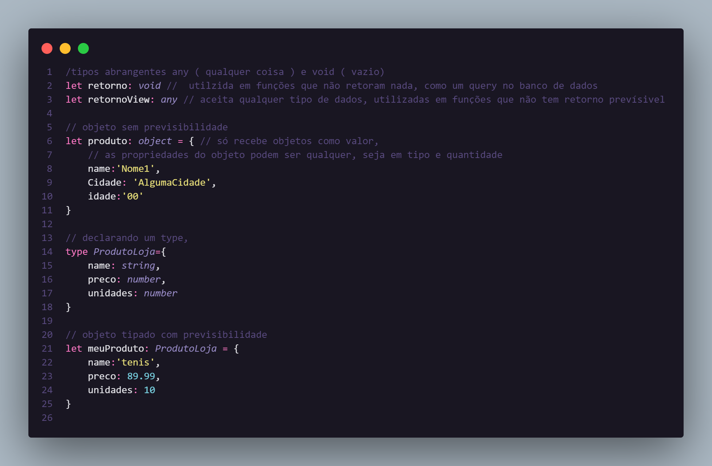

# Typescript para Angular

Typescript é um superset do javascript. Isso quer dizer o que typescript nada mais que é um javascript com alguns poderes a mais.

Uma das maiores diferenças entre o Javascript tradicional, é que o Typescript nos permite tipar as variáveis, a exemplo do que já acontece com outras liguagens de programação ( ex: JAVA ).

## Typescript e suas variáveis

Ao declararmos variáveis é necessário informar o tipo de dado que aquela variável irá receber. Além dos tipos primitivos - Boolena, String, Number, Null e Undefined -  o Typescript oferece outros formas de tiparmos as variáveis.

### Tipos Primitivos:

### Tipos Abrangentes:

- Void ⇒ utilizado para funções que não irão retornar nada
- any ⇒ variáveis aceitam qualquer tipo de dados
- object ⇒ para informar que irá receber um objeto como valor
- Types ⇒ são como formas, quando criados e atribuídos a um objeto, eles devem obrigatoriamente seguir a estrutura definida.

### Arrays:

Podem ser de apenas um tipo ou Multipos. Multipos podem ser tipados com mais de um tipo, porém a ordem desses tipos não importa dentro do Array.

### Tuplas:

As tuplas funcionam como arrays multi-tipos, porém com a diferença que os valores devem estar na mesma ordem que a tipagem.

---

### Funções:

As funções podem receber as mesmas tipagens que são passadas para as variáveis, podendo também serem multi-tipos.

---

### Async Functions:

---

### Interfaces:

Funcionam da mesma forma que os types. Porém, enquanto os types por convenção são utilizados para types variáveis e objetos, as Interfaces são utilizadas para tipar classes.

---

### Classes:

Classes são moldes, que são utilizados para criar coisas. Possuem um estrutura que deve ser seguida.

### Data Modifiers:

São modificadores de acesso que podem ser passados para as classes. Esse modificadores alteram a visibilidade das informações, e podem ser de 3 tipos:

- public ⇒ padrão, as informações são visíveis em qualquer lugar da aplicação;
- private ⇒ indica que as informações são visíveis apenas dentro do contexto da classe.
- protected ⇒ as informação são herdadas para as subclasses

---

### Subclasses:

São criadas a partir de uma classe pai ( Super Classe) e herdam suas propriedades, e também podem ter propriedades próprias.

---

### Generics:

Ao declarar funções é possível tipa-las de forma genérica, sendo os tipos informados na chamada da função. Dessa maneira podemos ter a mesma função lidando com diferentes tipos de dados.

---

### Decorators

São gatilhos que podemos colocar em classes ou atributos, esses gatilhos ao serem disparados irão excutar uma função definida.

