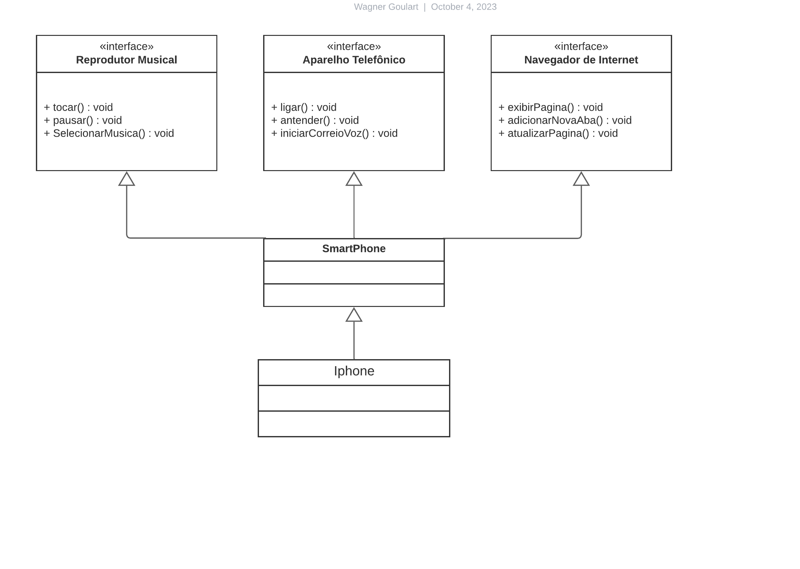

# Diagrama classes Iphone

Desafio proposto no bootcamp da DIO, onde é solicitado a criação de um diagrama de classes utilizando UML, e também a implementação das classes em arquvios .java

## Diagrama UML

