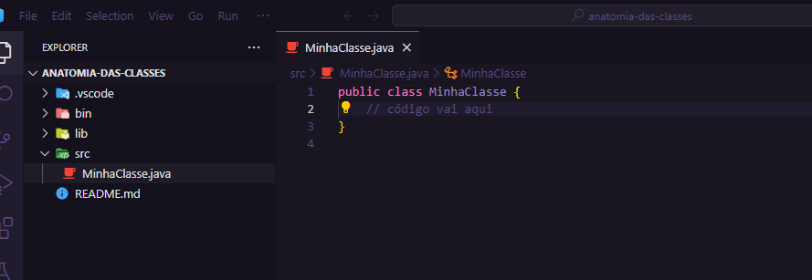
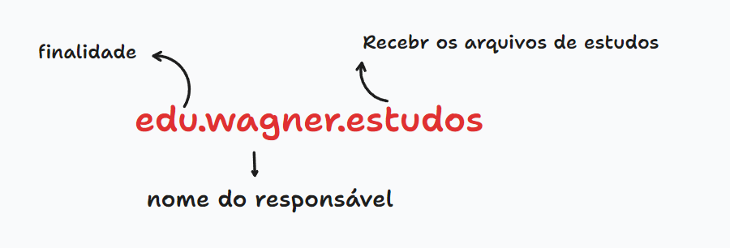

# Sintaxe Java 📝


---

## Anotamia de uma Classe 🩻
Por convenção o nome da classe e do arquivo onde a classe é criada é escrita em camlCase.



```java
// Bloco de criação da Classe
// Dentro das classes, podem conter outros blocos, que são os métodos

public class MinhaClasse {
    // Código vai aqui
}
```
## Método MAIN ( )
### Método main ( ):

Classes que executam alguma coisa precisam receber um método principal.

```java
public class MinhaClasse {
    public static void main(String[] args) {
        // método principal
    }
}
```

### Declarando variáveis:

<aside>
💡 tipo nomeDaVariável = Atribuição ( pode ser opcional em alguns casos )

</aside>

```jsx
public class MinhaClasse {
    public static void main(String[] args) {
        // VARIÁVEIS
        String meuNome = "Wagner";
        int anoFabricacao = 1989;

        boolean verdadeira = true;
      
    }
}
```

### Métodos:

<aside>
💡 TipoRetorno NomeObjetoNoInfinitivo Parametros( s )

</aside>

```jsx
public class MinhaClasse {
    public static void main(String[] args) {
        String primeiroNome = "Wagner";
        String segundoNome = "Goulart";

        // INVOCAÇÃO DO MÉTODO
        String nomeCompleto = nomeCompleto(primeiroNome, segundoNome);

        System.out.println(nomeCompleto);
    }

    // CRIAÇÃO DO MÉTODO
    public static String nomeCompleto(String primeiroNome, String segundoNome){
        return primeiroNome.concat(" ").concat(segundoNome);
    }
}
```

### Organizando Arquivos em projetos Java.

Por convenção, os projetos JAVA são organizados em pacotes. Pacotes nada mais são que pastas onde as classes ficam separados por finalizados.

Os pacotes devem ser criados seguindo uma estrura.

1. Finalidade do pacotes, podem ser:
    1. Educacional ( edu );
    2. Comerccial ( com );
    3. Organizacional ( org );
    4. openSourcer ( org / opensourcer );
2. O nome do responsável
3. Função do pacotes ( o que contém nele )



Esses pacotes precisam ser referenciados nas classes criadas dentro deles, para que eles funcionem de forma correta:

```jsx
// pacote sendo referenciado na classe
package edu.wagner.primeirasemana;

public class BoletimEstudantil {
    public static void main(String[] args) {
        int mediaFinal =6;

        if(mediaFinal < 6) 
            System.out.println("REPROVADO");
         else if ( mediaFinal ==6) 
            System.out.println("PROVA MINERVA");
         else 
            System.out.println("APROVADOR");
        
    }
}
```

### JavaBeans:

Iniciativa da comunidade para estruturação do escrita em JAVA.

- Variáveis
    
    Deve ser clara;
    
    Sempre no singular, salvo quando se referir a arrays;
    
    Padrão de idioma, todas as variáveis devem ser declaradas no mesmo idioma;
    
    Abreviações não são recomendadas;
    
- Métodos:
    
    Devem ser nomeados como verbor.
    
    Escritos em camelCase com a primeiro letra também maiúscula “MeuMetodo”
    
    Devem executar apenas um tarefa.

---

## Declarando variáveis:

Java é uma linguagem fortemente “tipada” o que indica que ao declararmos um variável precisamos dizer o JAVA qual o o dados que aquela variável irá armazenar.

### Tipos primitivos:

Esses tipos não são considerados objetos:

- String → armazena caracteres de texto;
- int → armazena números inteiros.
    
    <aside>
    💡 **Temos também o “byte” e o “short” que também server para armazenar números inteiros, porém o mais comum é utilizar a tipagem “int”**
    
    </aside>
    
- long → armazena números gigantes
- double →  armazena números com casas decimais
    
    <aside>
    💡 **O tipo float também serve para armazenar números com casas decimais, porém o mais comum é vermos esses números tipados com double**
    
    </aside>
    
- boolean → indica um valore lógico “true” ou “false”

### Constantes:

São um tipo de variável que não podem ter seu valor alterados após a atribuição.

São declarados com a palavra reservada “final” e por convenção devem ser escritas com letras maiúsculas.

```java
	  		// VARIÁVEL DE NUMERO INTEIRO DECLARADA COM BYTE
        byte  numeroCurto = 1;

         // VARIÁVEL DE NUMERO INTEIRO DECLARADA COM SHORT
        short numeroCurto2 = 2;

         // VARIÁVEL DE NUMERO INTEIRO DECLARADA COM INTER
        int numero = 10;

         // VARIÁVEL DE NUMERO INTEIRO DECLARADA COM LONG
         // ESSE TIPO DEVE CONTER UM "L" AO FINAL DO NUMERO
        long numeroGigantesco = 839571235063405L;

        // VARIÁVEL DE NUMERO INTEIRO DECLARADA COM FLOAT
        // ESSE TIPO DEVE CONTER UM "F" AO FINAL DO NUMERO
        float numeroDecimalComFloat = 0.2334553453f;

         // VARIÁVEL DE NUMERO INTEIRO DECLARADA COM DOUBLE
        double numeroDecimalcomDouble = 0.352345346456;

         // VARIÁVEL DE TEXTO INTEIRO DECLARADA COM STRING
        String meuNome = "Wagner";

        // CONSTANTE
        // DECLARADA COM A PALAVRA RESERVADA "FINAL"
       final double VALOR_DE_PI = 3.15;
```


## Operadores

Símbolos especiais, que contem significado especial para a linguagem, utilizamos eles para realizar operações dentro do código.

### Tipos de operadores:

- Atribuição
    
    > “ = “ <sinal de igual> ⇒ Utilizado para atribuir um valor a uma variável;
    > 
    > 
    > ```jsx
    > String nome = "Wagner";
    > ```
    > 
- Aritiméticos:
    
    > Utilizados para realizar operações matemáticas na aplicação
    > 
    > 
    > <soma> → + , se utilizado em variáveis que contenham String, os valores serão concatenados;
    > 
    > <Subtração> → -
    > 
    > <Multiplicação> → *
    > 
    > <Divisão> → /
    > 
    > <Módulo / Resto da divisão > %
    > 
    > ```jsx
    >   		int soma = 10 + 5;
    > 
    >       int subtracao = 10 - 5;
    > 
    >       int multiplicacao = 10 * 5;
    > 
    >       int divisao = 15 / 5;
    > 
    >       int modulo = 18 % 3;
    > ```
    > 
- Unários
    
    > Utilizados para operações como incrementar e decrementar
    > 
    > 
    > > ( + ) Operador unário de valor positivo;
    > > 
    > > 
    > > ( - ) Operador unário de valor negativo (nega um expressão ou número)
    > > 
    > > ( ++ ) Operador unário de incrementação ( incrementa o valor de 1 em 1 )
    > > 
    > > ( - - ) Operador unário de decrementação( decrementa o valor de 1 em 1 )
    > > 
    > > ( ! ) Operador unário de negação(nega o valor de uma expressão booleana )
    > > 
- Relacionais
    
    > Avaliam a relação entre 2 elementos, retornam valores booleanos como resultado
    > 
    > 
    > > ( = = ) → Igual a
    > > 
    > > 
    > > ( ! = ) → Diferente de
    > > 
    > > ( > ) → maior que
    > > 
    > > ( > =) → maior ou igual a
    > > 
    > > ( < ) → menor que
    > > 
    > > ( < = ) → menor ou igual a
    > > 
    > > ```java
    > > // ALGUNS EXEMPLOS
    > > // ESSAS REAÇÕES SÃO COMUMENTE UTILZIADOS DENTRO DE CONDIÇÕES
    > >        
    > >         int numero1 = 1;
    > >         int numero2 = 2;
    > >         
    > >         // COMPARA SE OS VALORES SÃO IGUAIS
    > >         boolean simNao = numero1 == numero2;
    > >         System.out.println(simNao); // FALSE
    > > 
    > >         // COMPARA SE OS VALORES SÃO DIFERENTES
    > >         simNao = numero1 != numero2;
    > >         System.out.println((simNao)); // TRUE
    > > 
    > >         // COMPARA SE O VALOR É MAIOR QUE O OUTRO
    > >         simNao = numero1 > numero2;
    > >         System.out.println((simNao)); // FALSE
    > > ```
    > > 
- Lógicos
    
    > ( &&) operador lógico para E → verifica se as duas condição são verdadeiras
    > 
    > 
    > ( | | ) operador lógico para OU → verifica se uma ou outro condição são verdadeiras
    > 
    > ```java
    > boolean condicao1 = true;
    >         boolean condicao2 = false;
    > 
    >         if( condicao1 && condicao2){
    >             System.out.println("AS DUAS SÃO VERDADEIRAS");
    >         }
    > 
    >         if(condicao1 || condicao2) {
    >             System.out.println("UMA DELAS É VERDADEIRA");
    >         }
    > 
    >         System.out.println("FIM");
    >     }
    > }
    > ```
    > 
- Ternário
    
    > Condicional IF escrito em apenas uma linha
    > 
    > 
    > <aside>
    > 💡 condição ? executa se o resultado for TRUE : executado ser for FALSE
    > 
    > </aside>
    >

## Métodos
 Métodos são funções que as classes podem executar.

No JAVA não existe o conceito de métodos globais, TODOS os métodos devem ser definidos dentro de uma classe.

Palavra chave “ void” indica que o método não retorna nada.

## Escope

Escopos delimitam o acesso da aplicação as variáveis que são criados. No JAVA temos 3 escopos, de Classe, de Métodos e de controle de fluxo.

### Escopo de classe:

As variáveis que são criadas dentro das chaves que delimitam um classe, são visíveis para toda classe, e podem ser acessadas pelos métodos e controles de fluxo.

### Escopo de métodos:

Variáveis que são criadas dentro de métodos, são visíveis apenas para esses métodos, e não podem ser acessadas de fora deles.

### Escopo de controle de fluxo:

Esses variáveis são criados, dentro de métodos de controle de fluxo e servem para controlar esse fluxo. São acessiveis apenas no contexto onde foram criadas.
